# gitWorkflow

Task Screenshots are as follows:

##  Updated Tasks
## New Release branch into QA
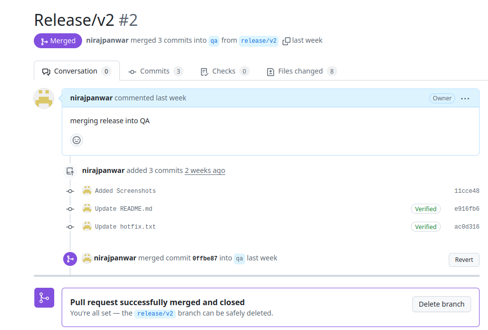

## New Release branch into stage

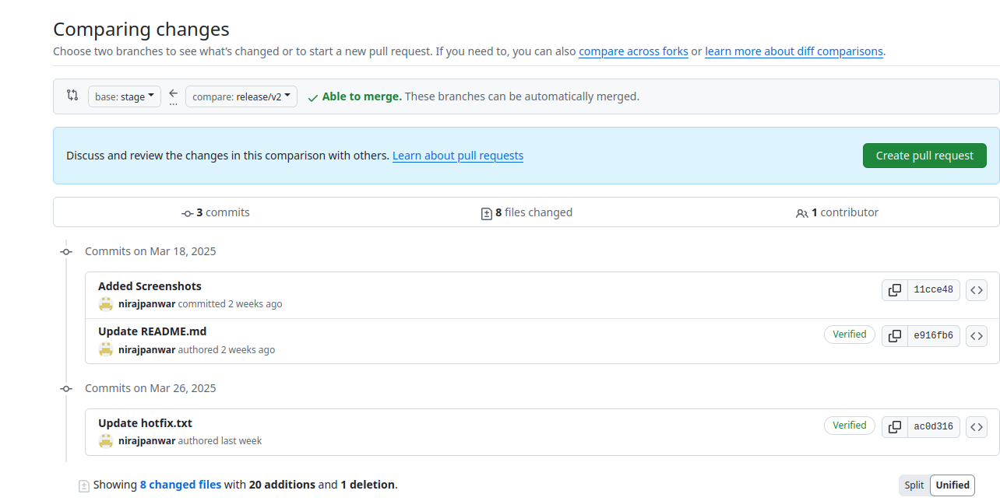

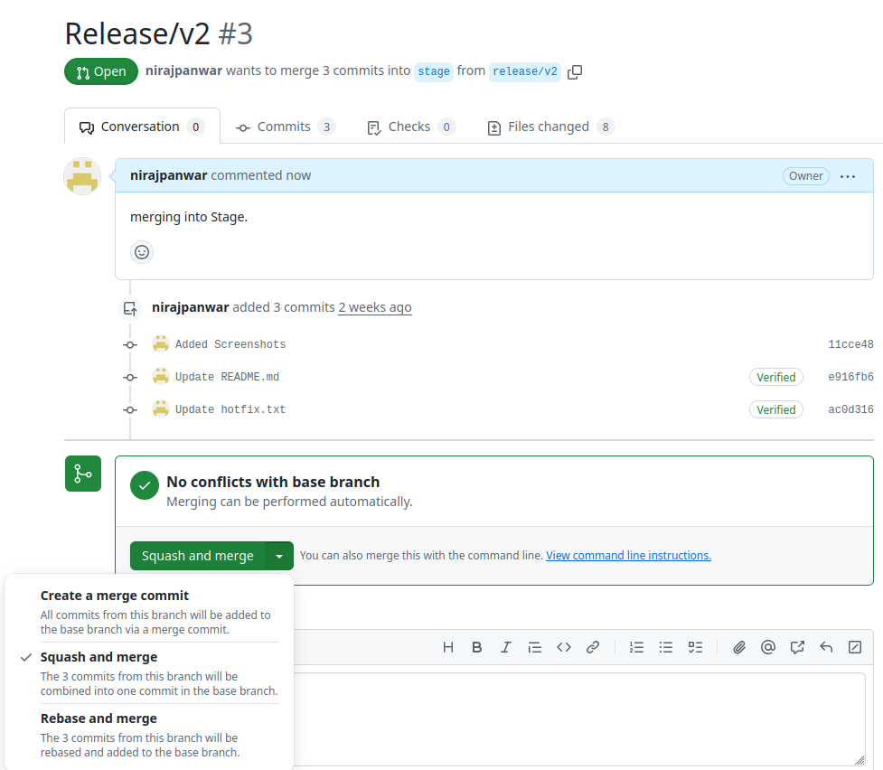

## Release into Main
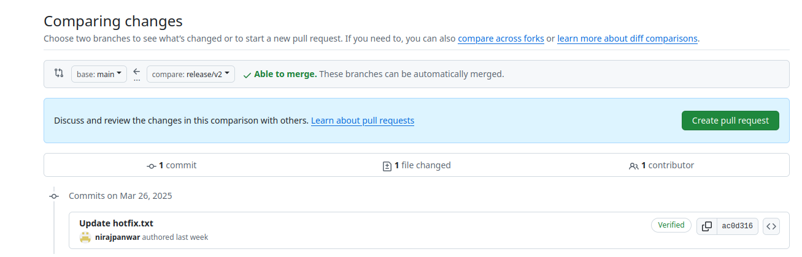

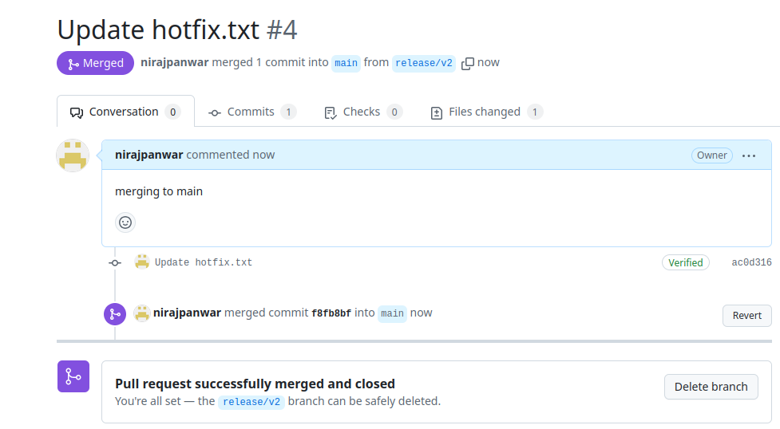

## Previous Tasks
## Part 1,2
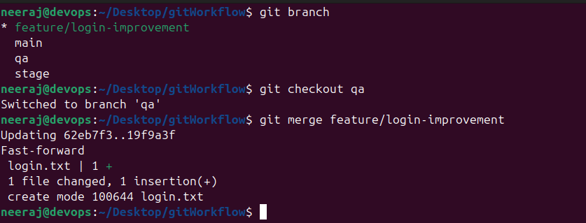

## Part 3,4,5,6
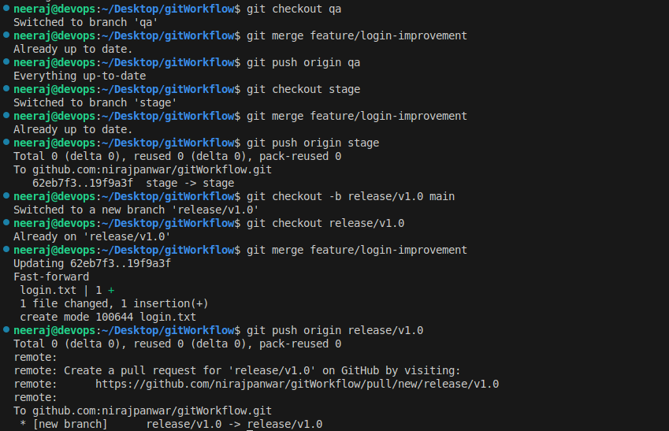

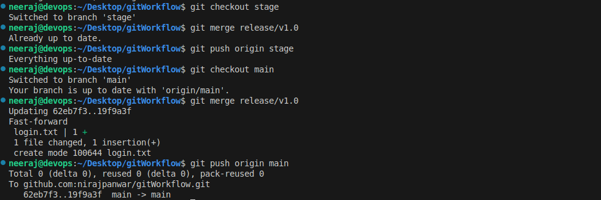

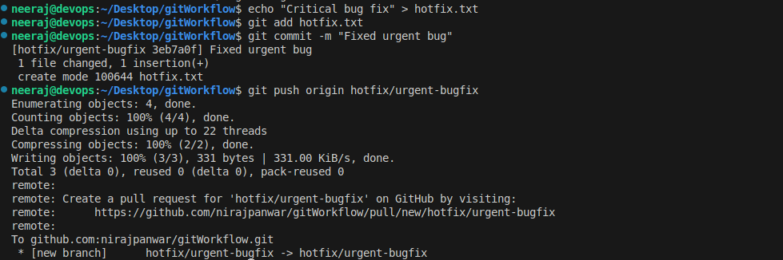

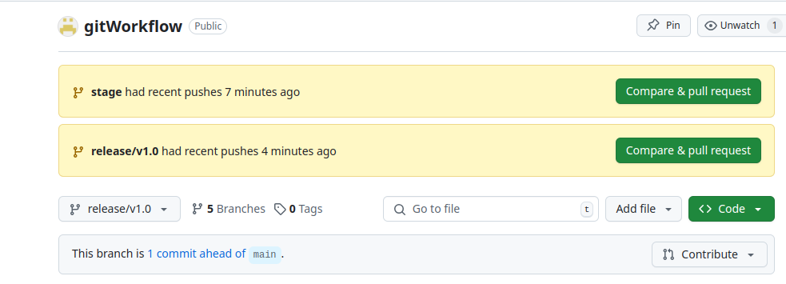

## Part 7
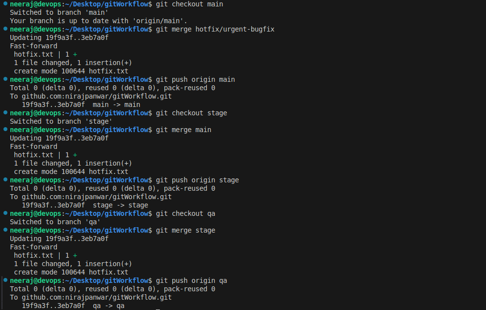
